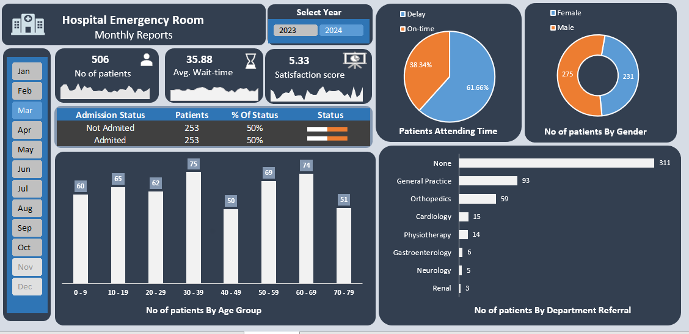
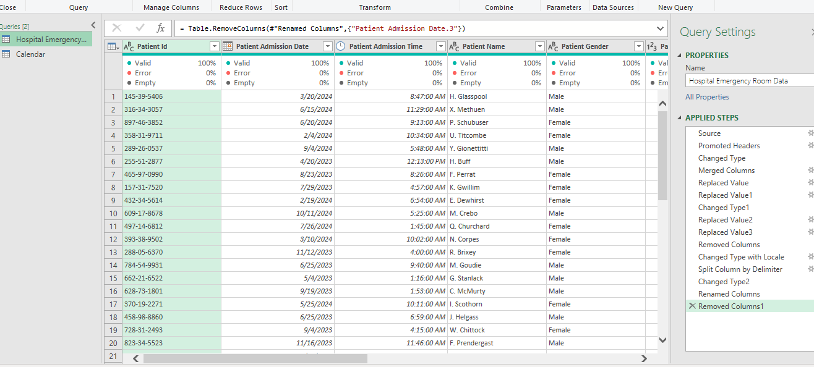
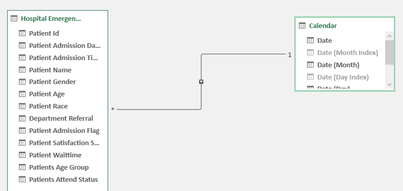
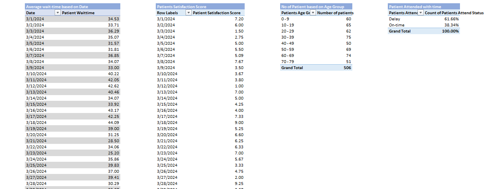
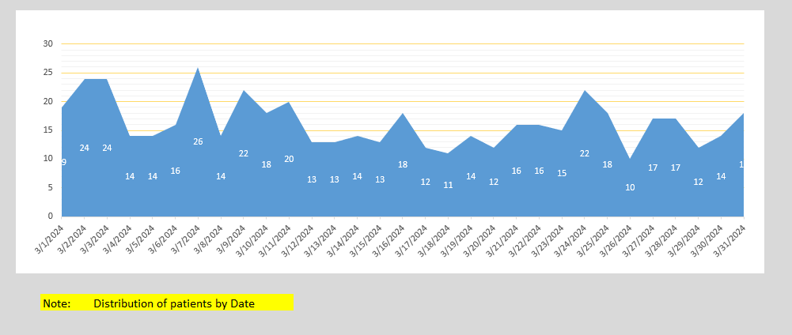
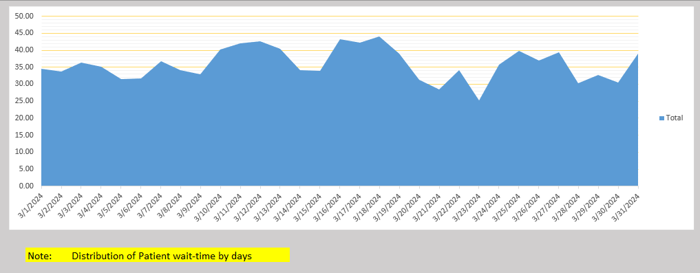

# Hospital-Emergency-Room-Analysis
An Excel-based dashboard for Hospital Emergency Room analysis, using Power Query, Power Pivot, and DAX to visualize key performance metrics and improve operational efficiency.

## 📌 Project Overview
This project aims to develop a comprehensive **Hospital Emergency Room Analysis Dashboard** that provides actionable insights for hospital management.  
The primary goal is to **improve efficiency, optimize patient flow, and enhance the overall quality of service**.  
The dashboard visualizes **key performance indicators (KPIs)** and patient data to help stakeholders monitor, analyze, and make data-driven decisions.

---



---

## ❗ Problem Statement
Hospitals often struggle with managing patient flow efficiently in emergency rooms.  
Without a clear overview of key metrics, it is difficult to identify bottlenecks, measure performance, and allocate resources effectively.  

This project addresses these challenges by consolidating critical data into a **single, interactive dashboard**.

---

## 🎯 Key Objectives
- **Monitor Patient Flow** → Track the total number of patients visiting the ER daily.  
- **Analyze Service Efficiency** → Calculate and monitor the average wait time for patients.  
- **Measure Service Quality** → Assess patient satisfaction scores to gauge care quality.  
- **Identify Trends and Patterns** → Spot busy days, seasonal trends, and performance drops.  
- **Provide Demographic Insights** → Analyze patient data by age, gender, and department referrals.  

---

## 🛠️ Technical Stack
This project was built using **Microsoft Excel** with the following tools:

### 🔹 Power Query
- Data connection, extraction, transformation, and loading (ETL).  
- Cleaning and preparing data (handling missing values, correcting data types, etc.).  
- Creating a **Calendar Table** for time-based analysis.

---



---

### 🔹 Power Pivot
- Building a professional **data model**.  
- Establishing relationships between patient data and the calendar table.  
- Centralizing data for efficient analysis.

---



---

### 🔹 Data Analysis Expressions (DAX)
Used to create custom measures and calculated columns for KPIs:  

``` DAX
Total Patients = COUNT(Patients[PatientID])

Average Wait Time = AVERAGE(Patients[WaitTime])

% Seen Within 30 Mins =
DIVIDE(
    COUNTROWS(FILTER(Patients, Patients[WaitTime] <= 30)),
    COUNTROWS(Patients)
)
```


## 🔹 Pivot Tables & Charts
Summarizing data into Pivot Tables for key metrics.

Designing charts (donut charts, bar charts, line charts) for visualization.

Building a clear, intuitive dashboard layout.

---



---



---



---

## 📊 Dashboard Features
The final dashboard provides insights into:

Overall KPIs → Number of Patients, Average Wait Time, Patient Satisfaction Score.

Patient Demographics → Age group and gender distribution.

Admission Status → Patients admitted vs. not admitted.

Performance Metrics → % of patients attended within 30 minutes.

Departmental Analysis → Most frequent department referrals.

## ✅ Project Outcome
This project successfully demonstrates the power of Excel’s BI tools to transform raw healthcare data into a dynamic, interactive dashboard.
It highlights how hospitals can:

Reduce waiting times.

Improve patient satisfaction.

Allocate resources effectively.

Make data-driven decisions for operational improvements.
